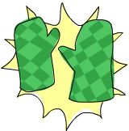

# Tuplas



Em alguns aspectos, tuplas são semelhantes a listas - são uma maneira de armazenar vários valores em um único valor. No entanto, existem algumas diferenças fundamentais. Uma lista de números é uma lista de números. Esse é o seu tipo e não importa se ela tem apenas um número ou uma quantidade infinita de números. Tuplas, no entanto, são usadas quando você sabe exatamente quantos valores deseja combinar e seu tipo depende de quantos componentes ela tem e dos tipos dos componentes. Elas são indicadas por parênteses e seus componentes são separados por vírgulas.

Outra diferença chave é que elas não precisam ser homogêneas. Ao contrário de uma lista, uma tupla pode conter uma combinação de vários tipos.

Vamos pensar em como representar um vetor bidimensional em Haskell. Uma maneira seria usar uma lista, o que poderia funcionar. E se quisermos colocar alguns vetores em uma lista para representar pontos de uma forma em um plano bidimensional? Poderíamos fazer algo como `[[1,2],[8,11],[4,5]]`. O problema com esse método é que também poderíamos fazer algo como `[[1,2],[8,11,5],[4,5]]`, que no Haskell não teria problema, já que ainda é uma lista de listas com números, mas isso meio que não faz sentido. No entanto, uma tupla de tamanho dois (também chamada de par) é seu próprio tipo, o que significa que uma lista não pode ter alguns pares e, em seguida, uma tripla (uma tupla de tamanho três). Portanto, vamos usar tuplas. Em vez de cercar os vetores com colchetes, usamos parênteses: `[(1,2),(8,11),(4,5)]`. O que aconteceria se tentássemos fazer uma forma como `[(1,2),(8,11,5),(4,5)]`? Bem, receberíamos este erro:

```haskell
• Couldn't match expected type ‘(a, b)’
                  with actual type ‘(a0, b0, c0)’
• In the expression: (8, 11, 5)
  In the expression: [(1, 2), (8, 11, 5), (4, 5)]
  In an equation for ‘it’: it = [(1, 2), (8, 11, 5), (4, 5)]
• Relevant bindings include
    it :: [(a, b)] (bound at <interactive>:1:1)
```

Está nos dizendo que tentamos usar um par e um triplo na mesma lista, o que não deveria acontecer. Você também não poderia fazer uma lista como `[(1,2),("One",2)]`, porque o primeiro elemento da lista é um par de números e o segundo elemento é um par composto por uma string e um número. Tuplas também podem ser usadas para representar uma ampla variedade de dados. Por exemplo, se quisermos representar o nome e a idade de alguém em Haskell, poderíamos usar uma triple: `("Christopher", "Walken", 55)`. Como visto neste exemplo, tuplas também podem conter listas.

Use tuplas quando souber antecipadamente quantos componentes algum dado deve ter. Tuplas são muito mais rígidas porque cada tamanho diferente de tupla é seu próprio tipo, então você não pode escrever uma função geral para anexar um elemento a uma tupla - você teria que escrever uma função para anexar a um par, uma função para anexar a uma triple, uma função para anexar a uma 4-tupla, etc.

Enquanto existem listas singleton, não há tal coisa como uma tupla singleton. Isso realmente não faz muito sentido quando você pensa sobre isso. Uma tupla singleton seria apenas o valor que ela contém e, como tal, não teria benefício para nós.

Como listas, tuplas podem ser comparadas entre si se seus componentes puderem ser comparados. Apenas não é possível comparar duas tuplas de tamanhos diferentes, enquanto você pode comparar duas listas de tamanhos diferentes. Duas funções úteis que operam em pares:

## `fst` 
Pega um par e retorna seu primeiro componente.

```haskell
ghci> fst (8,11)  
8  
ghci> fst ("Wow", False)  
"Wow"  
```

## `snd`
Pega um par e retorna seu segundo componente. Surpresa!

```haskell
ghci> snd (8,11)  
11  
ghci> snd ("Wow", False)  
False  
```

> **Nota:** essas funções operam apenas em pares. Elas não funcionarão em trincas, 4-tuplas, 5-tuplas, etc. Abordaremos a extração de dados de tuplas de diferentes maneiras um pouco mais tarde.

Uma função interessante que produz uma lista de pares é o `zip`. Ela pega duas listas e as une em uma lista, juntando os elementos correspondentes em pares. É uma função muito simples, mas tem muitos usos. É especialmente útil quando você deseja combinar duas listas de alguma forma ou percorrer duas listas simultaneamente. Aqui está uma demonstração.

```haskell
ghci> zip [1,2,3,4,5] [5,5,5,5,5]  
[(1,5),(2,5),(3,5),(4,5),(5,5)]  
ghci> zip [1 .. 5] ["one", "two", "three", "four", "five"]  
[(1,"one"),(2,"two"),(3,"three"),(4,"four"),(5,"five")]  
```

Ela emparelha os elementos e produz uma nova lista. O primeiro elemento vai com o primeiro, o segundo com o segundo, e assim por diante. Observe que, como os pares podem ter tipos diferentes, o `zip` pode pegar duas listas que contêm tipos diferentes e uni-las. O que acontece se os comprimentos das listas não coincidirem?

```haskell
ghci> zip [5,3,2,6,2,7,2,5,4,6,6] ["im","a","turtle"]  
[(5,"im"),(3,"a"),(2,"turtle")]  
```

A lista mais longa é simplesmente cortada para coincidir com o comprimento da mais curta. Como Haskell é preguiçoso, podemos unir listas finitas com listas infinitas.

```haskell
ghci> zip [1..] ["apple", "orange", "cherry", "mango"]  
[(1,"apple"),(2,"orange"),(3,"cherry"),(4,"mango")]  
```

Aqui está um problema que combina tuplas e compreensões de lista: qual triângulo retângulo que tem inteiros para todos os lados e todos os lados iguais ou menores que 10 tem um perímetro de 24? Primeiro, vamos tentar gerar todos os triângulos com lados iguais ou menores que 10.

```haskell
ghci> triangles = [ (a,b,c) | c <- [1..10], b <- [1..10], a <- [1..10] ]   
```

Estamos apenas retirando elementos de três listas, e nossa função de saída está combinando-os em uma tripla. Se você avaliar isso digitando `triangles` no GHCI, obterá uma lista de todos os triângulos possíveis com lados menores ou iguais a 10. Em seguida, adicionaremos uma condição de que todos eles precisam ser triângulos retângulos. Também modificaremos esta função levando em consideração que o lado `b` não é maior que a hipotenusa e que o lado `a` não é maior que o lado `b`.

```haskell
ghci> rightTriangles = [ (a,b,c) | c <- [1..10], b <- [1..c], a <- [1..b], a^2 + b^2 == c^2]   
```

Estamos quase lá. Agora, apenas modificamos a função dizendo que queremos aquelas em que o perímetro é 24.

```haskell
ghci> rightTriangles' = [ (a,b,c) | c <- [1..10], b <- [1..c], a <- [1..b], a^2 + b^2 == c^2, a+b+c == 24]  
ghci> rightTriangles'  
[(6,8,10)]  
```

E aqui está nossa resposta! Este é um padrão comum na programação funcional. Você pega um conjunto inicial de soluções e, em seguida, aplica transformações a essas soluções e as filtra até obter as corretas.